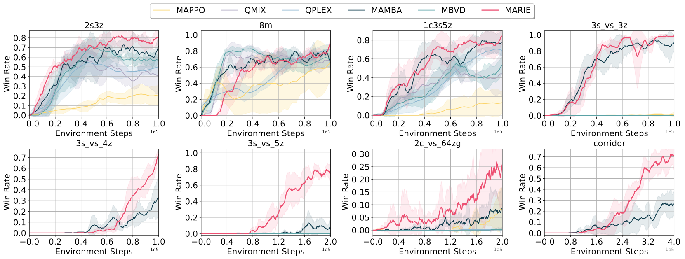
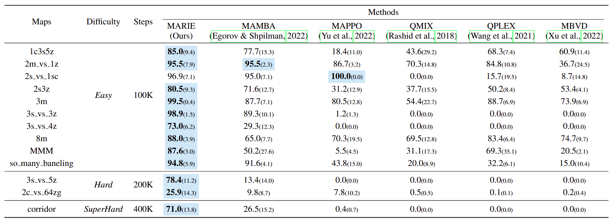
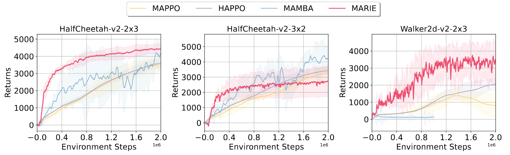

# MARIE - Multi-Agent auto-Regressive Imagination for Efficient learning
This code accompanies the paper "[Scalable Multi-Agent Model-Based Reinforcement Learning](https://arxiv.org/abs/2205.15023)".

Code for the paper *Decentralized Transformers with Centralized Aggregation are Sample-Efficient Multi-Agent World Models*. [Paper link](https://arxiv.org/abs/2406.15836)

## Installation

`python3.7` is required

```
pip install wheel
# Note: we don't run exp on Flatland. It only serves for running the code without errors.
pip install flatland-2.2.2/
pip install -r requirements.txt 
```

We currently implement the interfaces for common MARL environments and they can be used directly.

### Installing SMAC (Main exp)

Please follow [the official instructions](https://github.com/oxwhirl/smac) to install SMAC.

### Installing Google Research Football

Please follow [the official instructions](https://github.com/google-research/football) to install Google Research Football.

### Installing MPE

```
pip install pettingzoo==1.22.2
pip install supersuit==3.7.0
```

### Installing MAMujoco

Please follow [the instruction on PKU-HARL repo](https://github.com/PKU-MARL/HARL/tree/main) to install MAMujoco.

Encounter any issues with the usage of Mujoco? Refer to [this troubleshooting page](https://pytorch.org/rl/stable/reference/generated/knowledge_base/MUJOCO_INSTALLATION.html).

## Usage

An example for running MARIE on a specific environment

```
python3 train.py --n_workers 1 --env <ENV> --env_name <SCENARIO_NAME> --seed <SEED> --agent_conf <AGENT_CONF> \
  --steps <TOTAL_STEPS> --mode <WANDB_LOG_MODE> --tokenizer <TOKENIZER_CLASS> --decay 0.8 \
  --temperature <POLICY_TEMPERATURE> --sample_temp <SAMPLING_TEMPERATURE> --ce_for_av 
```

- ```ENV```: which environment to evaluate MARIE on. Four options: starcraft, football, pettingzoo, mamujoco
- ```SCENARIO_NAME```: which scenario or map to evaluate MARIE on. For example, in SMAC, we can set SCENARIO_NAME as *1c3s5z* to evaluate.
- ```AGENT_CONF```: which agent splitting configure to use in MAMujco. Only valid in running experiments on MAMujoco.
- ```TOTAL_STEPS```: the maximum environment steps in the low data regime.
- ```WANDB_LOG_MODE```: whether to enable wandb logging. Options: disabled, offline, online
- ```TOKENIZER_CLASS```: which tokenizer to use. Options: fsq, vq.
- ```POLICY_TEMPERATURE```: control the exploration of the policy (only useful in the case of discrete action space).
- ```SAMPLING_TEMPERATURE```: control the sample visitation probability during training VQ and World Model. (Refer to the balanced sampling in [TWM](https://github.com/jrobine/twm).)

Across all experiments in our work, we always set SAMPLING_TEMPERATURE as 'inf', i.e., standard sampling without any consideration of potential unbalanced sampling outcome.

### Reproduce


on SMAC
```
python train.py --n_workers 1 --env starcraft --env_name ${map_name} --seed 1 (or 2, 3, 4) --steps 100000 --mode online \
  --tokenizer vq --decay 0.8 --temperature 1.0 --sample_temp inf --ce_for_av
```
It is worth noting that:

(1) in *3s_vs_5z*, we set ```--temperature 2.0``` to introduce more exploration and sample more diverse trajectories for world model learning;

(2) in *2m_vs_1z*, we find that enabling distributional loss for reward predicition can stablize the learning of MARIE, and thus we additionally enable ```--ce_for_r``` during this scenario experiment.


on MAMujoco

```
python train.py --n_workers 1 --env mamujoco --env_name ${map_name} --seed ${seed} --agent_conf ${agent_conf} --steps 1000000 \
  --mode online --tokenizer vq --decay 0.8 --temperature 1.0 --sample_temp inf --ce_for_r
```

on Gfootball, although we have not reported corresponding results in the paper yet, in our early experiments, we recommend the readers to use ```--tokenizer fsq``` to run MARIE, which can robustly discretize the observation in the gfootball env.


## Acknowledgement

This repo is built upon [MAMBA - Scalable Multi-Agent Model-Based Reinforcement Learning](https://github.com/jbr-ai-labs/mamba). We thank the authors for their great work.

## Citation

If you find our paper or this repository helpful in your research or project, please consider citing our works using the following BibTeX citation:

```
@article{zhang2024decentralized,
  title={Decentralized Transformers with Centralized Aggregation are Sample-Efficient Multi-Agent World Models},
  author={Zhang, Yang and Bai, Chenjia and Zhao, Bin and Yan, Junchi and Li, Xiu and Li, Xuelong},
  journal={arXiv preprint arXiv:2406.15836},
  year={2024}
}
```
